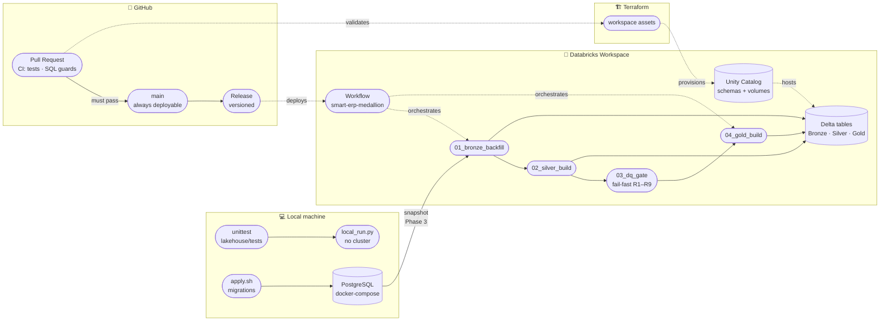

<h1 align="center">DataOps Lakehouse for E-commerce Analytics</h1>

<p align="center">
  <b>PostgreSQL + Databricks medallion lakehouse</b> — Bronze → Silver → DQ gate → Gold, Terraform-managed infra with PR-gated CI.
</p>

<p align="center">
  
  
  
  
  
  
  
  
  
  <a href="https://deepwiki.com/adriansalvadorekomo/smart-erp-dataopts"></a>
</p>

<p align="center">
  <sub>📖 Full wiki: <a href="https://deepwiki.com/adriansalvadorekomo/smart-erp-dataopts">deepwiki.com/adriansalvadorekomo/smart-erp-dataopts</a></sub>
</p>

<p align="center">
  <sub>👋 Hi, I'm <a href="https://github.com/adriansalvadorekomo"><b>Adrian Salvador Ekomo</b></a> — Computer Engineering student building toward a <b>Junior Data Engineer</b> role. This repo is my proof of work.</sub>
</p>

---

## Contents

- [1. Project Overview](#1-project-overview)
- [2. Architecture](#2-architecture)
  - [Overall Architecture Diagram — Data Flow](#overall-architecture-diagram--data-flow)
  - [Deployment & Execution View](#deployment--execution-view)
  - [Architecture Diagram Sources (D2 · Graphviz)](#architecture-diagram-sources-d2--graphviz)
  - [End-to-End Data Flow](#end-to-end-data-flow)
  - [Data Flow with Code Entities](#data-flow-with-code-entities)
- [3. Repository Layout & Code Entities](#3-repository-layout--code-entities)
- [4. OLTP Database Layer](#4-oltp-database-layer)
- [5. Seed Ingestion & Acceptance](#5-seed-ingestion--acceptance)
- [6. Configuration & Local Test Harness](#6-configuration--local-test-harness)
- [7. Orchestration & Infrastructure](#7-orchestration--infrastructure)
- [8. DataOps Process & CI/CD](#8-dataops-process--cicd)
- [9. Business Model, KPIs & Decisions](#9-business-model-kpis--decisions)
- [10. Roadmap — 10 Phases](#10-roadmap--10-phases)
- [11. Tech Stack](#11-tech-stack)
- [12. Getting Started](#12-getting-started)
- [13. Docs](#13-docs)
- [14. DataOps Principles](#14-dataops-principles)
- [15. Conclusion](#15-conclusion)

---

## 1. Project Overview

Most e-commerce data projects start with the dashboard. I started with the menu.

The thing that hooked me on data engineering is systems thinking — figuring out how pieces connect, what breaks when one part changes, and why. So when I set out to learn what "production-ready" actually means, I didn't build another notebook demo. I built a whole restaurant: a multi-seller marketplace (India, INR) with a transactional PostgreSQL core feeding a Databricks medallion lakehouse. Bronze preserves raw history. Silver standardizes entities. A fail-fast DQ gate (R1–R9) stands guard. Gold serves KPI-ready marts. Infrastructure is Terraform-managed, every merge is PR-gated through CI, and each of the 10 phases ships incrementally on a Trunk-Based Development trunk.

Along the way it taught me the unglamorous lessons that matter: contracts before code, quality gates before Gold, and infrastructure as code from day one — the same instincts I sharpened as a DevOps intern deploying Open edX on OpenStack, where a "permission denied" SSH error turned out to be a cloud-init timing issue, not the network.

- **Status:** Phases 1–5 done, lakehouse medallion validated at full 1M rows (DQ gate passed, revenue reconciled to baseline). Phases 6–10 incremental.
- **Full wiki:** [deepwiki.com/adriansalvadorekomo/smart-erp-dataopts](https://deepwiki.com/adriansalvadorekomo/smart-erp-dataopts) (Overview · Architecture · OLTP · Lakehouse · Orchestration · CI/CD · Glossary)

> *"Building this system is like opening a restaurant. First you decide the menu. Then you buy ingredients. Then you cook. Nobody opens a restaurant by hiring the AI sommelier first."*

---

## 2. Architecture

### Overall Architecture Diagram — Data Flow


**Legend** — 🟦 source system · 🟥 lakehouse stages · 🟩 consumption layers · 🟪 operational components — solid arrows carry data (`snapshot`, `standardize`, `validate`, `certified`), dashed arrows provision or gate (`provisions`, `gates`).

*PostgreSQL serves transactions; Databricks serves analytics. Bronze preserves
raw history, Silver standardizes entities, Gold serves KPIs. Full contract:
[`docs/lakehouse.md`](docs/lakehouse.md), decisions: [`docs/decisions.md`](docs/decisions.md).*

### Deployment & Execution View

A second illustration: not *what the data becomes*, but *where the code runs and how it ships* — local machine, GitHub, Databricks workspace, and Terraform.



**Legend** — `[()]` cylinder = data at rest · `([])` stadium = jobs, runners, and documents — solid arrows execute or produce, dashed arrows automate, provision, or gate.

### Architecture Diagram Sources (D2 · Graphviz · Mermaid)

The diagrams are maintained as text — version-controlled, easy to update, with SVG committed for direct viewing.

- **Mermaid source** — [`docs/architecture.mmd`](docs/architecture.mmd), rendered natively by GitHub above
- **D2 source** — [`docs/architecture.d2`](docs/architecture.d2), the preferred format for readability:
  `d2 docs/architecture.d2 docs/architecture.svg`
- **Graphviz (DOT) source** — [`docs/architecture.dot`](docs/architecture.dot), for broader compatibility:
  `dot -Tsvg docs/architecture.dot -o docs/architecture-gv.svg`

### End-to-End Data Flow

The pipeline implements a medallion architecture — Bronze → Silver → DQ gate → Gold — so only high-quality, reliable data reaches downstream BI, ML, and AI consumers.

#### PostgreSQL OLTP

The journey begins with the PostgreSQL OLTP database, the primary source for operational transactions: customers, sellers, products, inventory, orders, and order items.

#### Bronze Layer — Raw Ingestion

Raw, immutable copies of source data, preserving original schema and types for re-processing and auditing.

- **Ingestion method** — idempotent `COPY INTO` into Delta tables ([`lakehouse/src/bronze/ingest.py`](lakehouse/src/bronze/ingest.py))
- **Tables** — e.g. `bronze.raw_purchases` mirrors the OLTP purchases

#### Silver Layer — Standardized Entities

Cleansed, enterprise-wide entities conformed to a consistent schema via [`lakehouse/src/silver/transform.py`](lakehouse/src/silver/transform.py).

- **6 clean entities**, with Title-Case enums normalized (delivery statuses, payment methods, devices, categories) and the `final_price_ok` money invariant enforced on every order line

#### Data Quality Gate (R1–R9)

A fail-fast gate that blocks promotion to Gold when any critical rule fails.

- **Rules** — [`lakehouse/src/quality/rules.py`](lakehouse/src/quality/rules.py) (R1 no-NULL keys, R2 uniqueness, R3 FK integrity, R4 money invariant, R5+ enum conformance, …)
- **Runner** — [`lakehouse/src/quality/runner.py`](lakehouse/src/quality/runner.py), executed by the [`03_dq_gate`](lakehouse/notebooks/03_dq_gate.py) notebook

#### Gold Layer — Marts & SQL

Aggregated, denormalized marts optimized for reporting and analytics, defined in SQL and built by the [`04_gold_build`](lakehouse/notebooks/04_gold_build.py) notebook.

- **Marts** — `fact_sales`, `sales_daily`, `customer_360`, `inventory_kpis` ([`lakehouse/sql/gold/`](lakehouse/sql/gold/))

#### Consumption Layers — BI, ML, AI

- **BI** — Databricks SQL dashboards and reporting over Gold
- **ML** — Gold feeds models such as XGBoost churn prediction, tracked in MLflow
- **AI** — Genie / RAG grounded on governed Gold

#### Operational Components

- **Terraform** — provisions workspace assets (Unity Catalog schemas, landing volumes) for Bronze and Gold ([`infra/terraform/`](infra/terraform/))
- **PR-gated CI** — lakehouse tests, SQL guards, `terraform validate`; gates the DQ process so only quality-checked changes merge

### Data Flow with Code Entities

| Component | Code entity |
|---|---|
| Bronze ingestion (`COPY INTO`) | [`lakehouse/src/bronze/ingest.py`](lakehouse/src/bronze/ingest.py) · notebook [`01_bronze_backfill`](lakehouse/notebooks/01_bronze_backfill.py) |
| Silver transformation (6 entities) | [`lakehouse/src/silver/transform.py`](lakehouse/src/silver/transform.py) · notebook [`02_silver_build`](lakehouse/notebooks/02_silver_build.py) |
| DQ gate R1–R9 (fail-fast) | [`lakehouse/src/quality/rules.py`](lakehouse/src/quality/rules.py) · [`lakehouse/src/quality/runner.py`](lakehouse/src/quality/runner.py) · notebook [`03_dq_gate`](lakehouse/notebooks/03_dq_gate.py) |
| Gold marts (SQL) | [`lakehouse/sql/gold/`](lakehouse/sql/gold/) · [`lakehouse/src/gold/models.py`](lakehouse/src/gold/models.py) · notebook [`04_gold_build`](lakehouse/notebooks/04_gold_build.py) |
| Orchestration | [`lakehouse/workflows/`](lakehouse/workflows/) (Databricks `smart-erp-medallion` job) |
| Local verification | [`lakehouse/local_run.py`](lakehouse/local_run.py) · [`lakehouse/tests/`](lakehouse/tests/) |

---

## 3. Repository Layout & Code Entities

The repo is organized by platform phase — OLTP schema, lakehouse stages, infrastructure, and application scaffolds stay isolated so each phase ships independently.

```
smart-erp-dataopts/
├── docs/                # [1] Business model — KPIs, money flow, domain definitions
├── database/            # [2] PostgreSQL schema + versioned migrations (apply.sh)
├── scripts/seed/        # [3] Dataset ingestion scaffold (CSV → raw → normalized, validated)
├── backend/app/         # [4] FastAPI scaffold — api/ core/ models/ schemas/ services/
├── frontend/            # [5] React scaffold (Vite) + TanStack Query + shadcn/ui
├── lakehouse/           # [6] Databricks medallion: src/{bronze,silver,gold,quality} workflows/ sql/gold/ tests/
├── data/
│   └── amazon-e-commerce/ # source CSV (git-ignored, 1M rows)
├── bi/                  # [7] Dashboard exports (Databricks SQL is the core BI layer)
├── ml/                  # [8] Return propensity + churn scaffold (MLflow-native)
├── rag/                 # [9] Grounded-assistant scaffold over governed Gold
└── infra/               # [10] Terraform (workspace) + docker-compose (local Postgres)
```

---

## 4. OLTP Database Layer

PostgreSQL is the transactional foundation: raw CSV landing tables, typed staging intermediates, and normalized core tables — all under a strict contract ([`docs/business-model.md`](docs/business-model.md) §2–§3, §6).

| Schema | Role |
|--------|------|
| `raw` | CSV landing (`raw.purchases`, all TEXT) |
| `staging` | Typed intermediate (`staging.purchases`) |
| `public` | Six core tables: `customers`, `orders`, `order_items`, `products`, `sellers`, `inventory` |

Migrations ([`database/migrations/`](database/migrations/), applied in order via [`database/apply.sh`](database/apply.sh)) enforce the invariants in DDL: `final_price` checksum (± ₹5.00), `delivery_status` domain, validated payment/device/category sets, idempotent inventory snapshots. Details: [`database/README.md`](database/README.md).

---

## 5. Seed Ingestion & Acceptance

Phase 3 loads the 1M-row Amazon-style CSV through `raw.purchases` → `staging.purchases` → normalized `public` tables, with acceptance checks (row counts + strict revenue checksum baseline) before any medallion ingestion. Status: **done** — [`scripts/seed/`](scripts/seed/) ingests idempotently and `acceptance.py` passes (1M orders, revenue ₹9,938,876,985 ± ₹1,000).

---

## 6. Configuration & Local Test Harness

No cluster needed to verify contracts: environment-driven catalog/schema resolution lives in [`lakehouse/src/common/config.py`](lakehouse/src/common/config.py), [`lakehouse/local_run.py`](lakehouse/local_run.py) executes the pipeline end-to-end locally, and the `unittest` suite under [`lakehouse/tests/`](lakehouse/tests/) covers transforms and quality rules.

```bash
python -m unittest discover -s lakehouse/tests -v
python lakehouse/local_run.py
```

---

## 7. Orchestration & Infrastructure

- **Databricks Workflow** — the `smart-erp-medallion` job ([`lakehouse/workflows/smart_erp_job.json`](lakehouse/workflows/smart_erp_job.json)) chains backfill → Silver build → DQ gate → Gold build; deployed manually on Free Edition.
- **Terraform** — [`infra/terraform/`](infra/terraform/) provisions workspace assets (schemas, landing volumes). Validate with `terraform init -backend=false && terraform validate`.
- **Free Edition constraints** — dev/prod equivalence notes live in [`docs/databricks-free-edition.md`](docs/databricks-free-edition.md).

---

## 8. DataOps Process & CI/CD

Trunk-Based Development: `main` is the always-deployable trunk, short-lived feature branches merge back via PR, and CI must pass ([`docs/branching-strategy.md`](docs/branching-strategy.md)).

| Pipeline | Checks |
|---|---|
| **CI** ([`ci.yml`](.github/workflows/ci.yml)) | uv lockfile in sync · Python lint/compile · lakehouse unit tests (no cluster) · SQL guards · `terraform validate` |
| **Release** ([`release.yml`](.github/workflows/release.yml)) | Versioned release candidates on every `main` merge |

---

## 9. Business Model, KPIs & Decisions

Every table in this repo answers to a business contract. This section is that contract in miniature — the domain, the numbers that matter, and the architectural rulings behind every technology choice. Full text: [`docs/business-model.md`](docs/business-model.md) and [`docs/decisions.md`](docs/decisions.md).

### Domain Contract & Core Entities

Smart-ERP is a multi-seller e-commerce marketplace in India, transacting in Indian Rupees (INR, ₹): a 24-month window of operational data (**2024-03-31 → 2026-03-31**), **1,000,000 orders** across **603,815 customers**, **9,000 independent sellers**, and **89,999 products** in 5 categories (Electronics, Home, Sports, Beauty, Clothing).

The contract is enforced across six core PostgreSQL tables ([`database/migrations/002_core_tables.sql`](database/migrations/002_core_tables.sql)) and mirrored through the medallion layers:

```
customers 1 ──── ∞ orders 1 ──── ∞ order_items ∞ ──── 1 products
sellers   1 ──── ∞ order_items         products 1 ──── ∞ inventory (snapshots)
```

**Order lifecycle** (`orders.delivery_status`): `IN TRANSIT` (29.4%, dispatch) → `DELIVERED` (29.5%, terminal success) · `DELAYED` (29.5%, exception) · `RETURNED` (11.6%, reverse logistics).

### KPI Definitions & Gold Marts

KPIs are computed deterministically in the Gold layer ([`lakehouse/sql/gold/`](lakehouse/sql/gold/) + [`lakehouse/src/gold/models.py`](lakehouse/src/gold/models.py)):

| KPI | Definition | Gold mart | Business intent |
|---|---|---|---|
| Average Order Value (AOV) | Σ final_price / total orders | `fact_sales` | Basket size and pricing health |
| Return Rate | orders with status RETURNED / all orders | `sales_daily` | Fulfillment & quality signal (baseline: 11.6%) |
| Customer Concentration (Pareto) | Revenue share of top 20% customers | `customer_360` | Revenue risk (observed: top 20% drive 62.9%) |
| Stock-Critical Products | Products with latest stock < 20 | `inventory_kpis` | Reorder alerts (baseline: 3,561 items) |

### Architectural Decision Records (ADRs)

Technology choices are rulings, not accidents — full log in [`docs/decisions.md`](docs/decisions.md):

- **ADR-1** — Databricks over Airflow + dbt + Postgres analytics: one analytical plane, fewer seams
- **ADR-2** — PostgreSQL remains OLTP: protects transactional performance from analytical queries
- **ADR-3** — Medallion (Bronze / Silver / Gold): raw auditability → clean entities → governed marts
- **ADR-4** — PySpark / SQL instead of dbt: one SQL framework, simpler CI graph
- **ADR-5** — Databricks Workflows instead of Airflow: native orchestration ([`lakehouse/workflows/smart_erp_job.json`](lakehouse/workflows/smart_erp_job.json))
- **ADR-6** — Databricks SQL instead of Metabase as core BI: workspace-native serving
- **ADR-7** — MLflow (Databricks-native): experiment tracking + model registry for churn / return propensity
- **ADR-8** — Local-first dev with prod equivalents: every cloud capability has a zero-credential harness ([`lakehouse/local_run.py`](lakehouse/local_run.py) + `unittest`)

---

## 10. Roadmap — 10 Phases

| Phase | Component | Status |
|-------|-----------|--------|
| 1 | **Business Model** — multi-seller marketplace (India, INR), KPIs, money flow — [docs/business-model.md](docs/business-model.md) | 🟢 Done |
| 2 | **Database** — PostgreSQL with 6 core tables + `raw`/`staging` — [database/](database/) | 🟢 Done |
| 3 | **Seed Data** — Ingest 1M-row Amazon-style dataset (CSV → `raw` schema → normalized tables, with acceptance checks) | 🟢 Done |
| 4 | **Backend** — FastAPI + SQLAlchemy with atomic transactions, audit logging, Pydantic validation | 🟢 Done |
| 5 | **Web App** — React (Vite) + TanStack Query + shadcn/ui | 🟢 Done |
| 6 | **Data Platform** — Databricks Lakehouse (Bronze → Silver → DQ gate → Gold, Workflows) — [lakehouse/](lakehouse/) · [docs/lakehouse.md](docs/lakehouse.md) | 🟢 Done (Free Edition scope) |
| 7 | **BI** — Databricks SQL over Gold (revenue, top clients, stock critical, order funnel) | 🟡 Planned |
| 8 | **ML** — Return propensity + customer churn (scikit-learn/XGBoost), MLflow-native tracking | 🟡 Planned |
| 9 | **AI** — Grounded assistant over governed Gold (Genie / SQL-first; no generic chatbot) | 🟡 Planned |
| 10 | **Deploy + Demo** — Terraform (workspace assets) + Docker Compose (local Postgres) | 🟡 Planned |

---

## 11. Tech Stack

| Layer | Technology |
|-------|-----------|
| **OLTP Database** | PostgreSQL (transactions, CHECKs, lifecycle contract) |
| **Data Platform** | Databricks Free Edition · Delta Lake · Unity Catalog · PySpark · Databricks SQL · Workflows |
| **Data Architecture** | Medallion: Bronze → Silver → DQ gate → Gold |
| **Backend** | Python 3.12, FastAPI, SQLAlchemy, Pydantic |
| **Frontend** | React (Vite), TanStack Query, shadcn/ui |
| **ML / MLOps** | scikit-learn, XGBoost, MLflow (Databricks-native) |
| **AI** | Genie / SQL-grounded assistant over governed Gold (vector search only if justified) |
| **Infrastructure** | Terraform (workspace assets), Docker Compose (local Postgres) |
| **Package Manager** | uv |

> Retired: Airbyte, dbt, Airflow, Metabase-as-core, pgvector-as-sidecar — see
> [docs/decisions.md](docs/decisions.md) (ADRs 1–8) for why. `bi/` stays as an export folder.

---

## 12. Getting Started

```bash
# Clone the repository
git clone https://github.com/adriansalvadorekomo/smart-erp-dataopts.git
cd smart-erp-dataopts

# Set up environment
uv venv
source .venv/bin/activate
uv sync

# Verify the lakehouse contracts (no DB, no cluster needed)
python -m unittest discover -s lakehouse/tests -v
python lakehouse/local_run.py

# OLTP: apply migrations (needs PostgreSQL)
./database/apply.sh

# Phase 3: ingest the 1M CSV, then run acceptance checks
python3 scripts/seed/ingest.py && python3 scripts/seed/acceptance.py

# Workspace (Free Edition): validate infra, deploy job manually
cd infra/terraform && terraform init -backend=false && terraform validate
```

> Local Postgres for development: `docker compose -f infra/docker-compose.yml up -d`.
> Databricks connection: `DATABRICKS_HOST` + `DATABRICKS_TOKEN` from env —
> see [`docs/databricks-free-edition.md`](docs/databricks-free-edition.md). Never commit secrets.

---

## 13. Docs

- **Business model & data contract** — [`docs/business-model.md`](docs/business-model.md) (single source of truth for Phases 2–9)
- **Lakehouse architecture** — [`docs/lakehouse.md`](docs/lakehouse.md) (Bronze/Silver/Gold, flows, KPI→Gold matrix)
- **Decision log** — [`docs/decisions.md`](docs/decisions.md) (why Databricks, why medallion, why no dbt/Airflow/…)
- **Free Edition limits** — [`docs/databricks-free-edition.md`](docs/databricks-free-edition.md) (dev/prod equivalence)
- **Branching & CI/CD** — [`docs/branching-strategy.md`](docs/branching-strategy.md) (Trunk-Based Development, GitHub Actions pipeline)
- **Database** — [`database/README.md`](database/README.md) (migrations, invariants, apply)
- **Backend** — run via `uv run uvicorn backend.app.main:app --port 8000` (endpoints: `POST/GET /orders`, `PATCH /orders/{id}/status`, `GET /health`)
- **Frontend** — [`frontend/README.md`](frontend/README.md) (run guide) · [`docs/frontend.md`](docs/frontend.md) (pages, data flow, scope)
- **Lakehouse package** — [`lakehouse/README.md`](lakehouse/README.md) (layout, verify commands)
- **Full wiki** — [deepwiki.com/adriansalvadorekomo/smart-erp-dataopts](https://deepwiki.com/adriansalvadorekomo/smart-erp-dataopts) (Overview · Architecture · OLTP · Lakehouse · Orchestration · CI/CD · Glossary)

---

## 14. DataOps Principles

Every phase follows these three rules:

- **Automate** the repetitive (pipelines, tests, deploys)
- **Version** everything (code, schemas, models, data)
- **Observe** always (logs, metrics, alerts from day one)

---

## 15. Conclusion

This repo started as a question — *what does "production-ready" actually mean?* — and became my answer: contracts before code, quality gates before Gold, infrastructure as code from day one. The warehouse runs, the gates hold, and every phase ships through a green pipeline.

What's next is the exciting part: seed the million rows, raise the FastAPI backend, and grow Gold into dashboards, churn models, and a grounded AI assistant. If data systems that fail loudly instead of silently is your kind of engineering, let's talk.

---

<p align="center">
  <sub>Built with DataOps · Questions drive the warehouse, not source schemas</sub>
  <br />
  <sub>👋 <a href="https://github.com/adriansalvadorekomo"><b>Adrian Salvador Ekomo</b></a> · <a href="https://linkedin.com/in/adrian-salvador-ekomo-mesi-obono-5990b8182">LinkedIn</a> · seeking a Junior Data Engineer role</sub>
</p>
