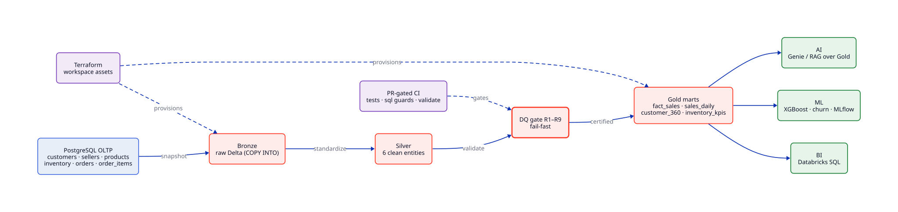
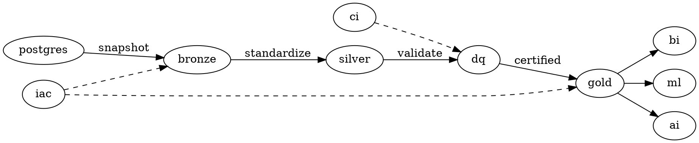

<h1 align="center">Smart-ERP · DataOps</h1>

<p align="center">
  <b>DataOps-driven ERP for e-commerce</b> — 10-phase build from business model to AI-powered chat assistant.
</p>

<p align="center">
  
  
  
  
  
  
  
  
  
</p>

---

## Architecture



*PostgreSQL serves transactions; Databricks serves analytics. Bronze preserves
raw history, Silver standardizes entities, Gold serves KPIs. Full contract:
[`docs/lakehouse.md`](docs/lakehouse.md), decisions: [`docs/decisions.md`](docs/decisions.md).*

<details>
<summary><b>Diagram sources (D2 · Graphviz)</b></summary>

- [`docs/architecture.d2`](docs/architecture.d2) — render with `d2 docs/architecture.d2 docs/architecture.svg`
- [`docs/architecture.dot`](docs/architecture.dot) — render with `dot -Tsvg docs/architecture.dot -o docs/architecture-gv.svg`

```d2
direction: right

postgres: "PostgreSQL OLTP\ncustomers · sellers · products\ninventory · orders · order_items"
bronze: "Bronze\nraw Delta (COPY INTO)"
silver: "Silver\n6 clean entities"
dq: "DQ gate R1–R9\nfail-fast"
gold: "Gold marts\nfact_sales · sales_daily\ncustomer_360 · inventory_kpis"
bi: "BI\nDatabricks SQL"
ml: "ML\nXGBoost · churn · MLflow"
ai: "AI\nGenie / RAG over Gold"
iac: "Terraform\nworkspace assets"
ci: "PR-gated CI\ntests · sql guards · validate"

postgres -> bronze: snapshot
bronze -> silver: standardize
silver -> dq: validate
dq -> gold: certified
gold -> bi
gold -> ml
gold -> ai
iac -> bronze: provisions
iac -> gold: provisions
ci -> dq: gates
```



</details>

---

## Phases

| Phase | Component | Status |
|-------|-----------|--------|
| 1 | **Business Model** — multi-seller marketplace (India, INR), KPIs, money flow — [docs/business-model.md](docs/business-model.md) | 🟢 Done |
| 2 | **Database** — PostgreSQL with 6 core tables + `raw`/`staging` — [database/](database/) | 🟢 Done |
| 3 | **Seed Data** — Ingest 1M-row Amazon-style dataset (CSV → `raw` schema → normalized tables, with acceptance checks) | 🟡 Next |
| 4 | **Backend** — FastAPI + SQLAlchemy with atomic transactions, audit logging, Pydantic validation | 🟡 Planned |
| 5 | **Web App** — React (Vite) + TanStack Query + shadcn/ui | 🟡 Planned |
| 6 | **Data Platform** — Databricks Lakehouse (Bronze → Silver → DQ gate → Gold, Workflows) — [lakehouse/](lakehouse/) · [docs/lakehouse.md](docs/lakehouse.md) | 🟡 Skeleton |
| 7 | **BI** — Databricks SQL over Gold (revenue, top clients, stock critical, order funnel) | 🟡 Planned |
| 8 | **ML** — Return propensity + customer churn (scikit-learn/XGBoost), MLflow-native tracking | 🟡 Planned |
| 9 | **AI** — Grounded assistant over governed Gold (Genie / SQL-first; no generic chatbot) | 🟡 Planned |
| 10 | **Deploy + Demo** — Terraform (workspace assets) + Docker Compose (local Postgres) | 🟡 Planned |

---

## Tech Stack

| Layer | Technology |
|-------|-----------|
| **OLTP Database** | PostgreSQL (transactions, CHECKs, lifecycle contract) |
| **Data Platform** | Databricks Free Edition · Delta Lake · Unity Catalog · PySpark · Databricks SQL · Workflows |
| **Data Architecture** | Medallion: Bronze → Silver → DQ gate → Gold |
| **Backend** | Python 3.12, FastAPI, SQLAlchemy, Pydantic |
| **Frontend** | React (Vite), TanStack Query, shadcn/ui |
| **ML / MLOps** | scikit-learn, XGBoost, MLflow (Databricks-native) |
| **AI** | Genie / SQL-grounded assistant over governed Gold (vector search only if justified) |
| **Infrastructure** | Terraform (workspace assets), Docker Compose (local Postgres) |
| **Package Manager** | uv |

> Retired: Airbyte, dbt, Airflow, Metabase-as-core, pgvector-as-sidecar — see
> [docs/decisions.md](docs/decisions.md) (ADRs 1–7) for why. `bi/` stays as an export folder.

---

## Project Structure

```
smart-erp/
├── docs/                # [1] Business model — KPIs, money flow, domain definitions
├── database/            # [2] PostgreSQL schema + versioned migrations (apply.sh)
├── scripts/seed/        # [3] Dataset ingestion (CSV → raw → normalized, validated)
├── backend/app/         # [4] FastAPI — api/ core/ models/ schemas/ services/
├── frontend/            # [5] React (Vite) + TanStack Query + shadcn/ui
├── lakehouse/           # [6] Databricks medallion: src/{bronze,silver,gold,quality} workflows/ sql/gold/ tests/
├── data/
│   └── amazon-e-commerce/ # source CSV (git-ignored, 1M rows)
├── bi/                  # [7] Dashboard exports (Databricks SQL is the core BI layer)
├── ml/                  # [8] Return propensity + churn (MLflow-native)
├── rag/                 # [9] Grounded assistant over governed Gold
└── infra/               # [10] Terraform (workspace) + docker-compose (local Postgres)
```

## Docs

- **Business model & data contract** — [`docs/business-model.md`](docs/business-model.md) (single source of truth for Phases 2–9)
- **Lakehouse architecture** — [`docs/lakehouse.md`](docs/lakehouse.md) (Bronze/Silver/Gold, flows, KPI→Gold matrix)
- **Decision log** — [`docs/decisions.md`](docs/decisions.md) (why Databricks, why medallion, why no dbt/Airflow/…)
- **Free Edition limits** — [`docs/databricks-free-edition.md`](docs/databricks-free-edition.md) (dev/prod equivalence)
- **Branching & CI/CD** — [`docs/branching-strategy.md`](docs/branching-strategy.md) (Trunk-Based Development, GitHub Actions pipeline)
- **Database** — [`database/README.md`](database/README.md) (migrations, invariants, apply)
- **Lakehouse package** — [`lakehouse/README.md`](lakehouse/README.md) (layout, verify commands)

---

## Quick Start

```bash
# Clone the repository
git clone https://github.com/adriansalvadorekomo/smart-erp-dataopts.git
cd smart-erp-dataopts

# Set up environment
uv venv
source .venv/bin/activate
uv sync

# Verify the lakehouse contracts (no DB, no cluster needed)
python -m unittest discover -s lakehouse/tests -v
python lakehouse/local_run.py

# OLTP: apply migrations, then ingest (needs PostgreSQL + the 1M CSV)
./database/apply.sh
python3 scripts/seed/ingest.py && python3 scripts/seed/acceptance.py

# Workspace (Free Edition): validate infra, deploy job manually
cd infra/terraform && terraform init -backend=false && terraform validate
```

> Local Postgres for development: `docker compose -f infra/docker-compose.yml up -d`.
> Databricks connection: `DATABRICKS_HOST` + `DATABRICKS_TOKEN` from env —
> see [`docs/databricks-free-edition.md`](docs/databricks-free-edition.md). Never commit secrets.

> **Note:** This project is in early development. Each phase is being built incrementally following the methodology outlined in the [project documentation](https://github.com/adriansalvadorekomo/smart-erp-dataopts).

---

## DataOps Principles

Every phase follows these three rules:

- **Automate** the repetitive (pipelines, tests, deploys)
- **Version** everything (code, schemas, models, data)
- **Observe** always (logs, metrics, alerts from day one)

> *"Building this system is like opening a restaurant. First you decide the menu. Then you buy ingredients. Then you cook. Nobody opens a restaurant by hiring the AI sommelier first."*

---

## Why This Matters

This project demonstrates a complete **Data Engineering & Lakehouse workflow**:

- **OLTP modeling** in PostgreSQL (6 tables, CHECKs, lifecycle contract)
- **Medallion architecture** on Databricks (Bronze → Silver → DQ gate → Gold)
- **Data quality as code** (rules R1–R9, fail-fast before Gold)
- **Pipeline-as-software** (versioned, tested, reproducible, observable)
- **ML model lifecycle** tracking with native MLflow
- **Governed AI** — grounded answers over Gold, never a chatbot bypassing the platform
- **Infrastructure as code** with Terraform; CI-gated Trunk-Based Development

---

<p align="center">
  <sub>Built with DataOps · Questions drive the warehouse, not source schemas</sub>
</p>
